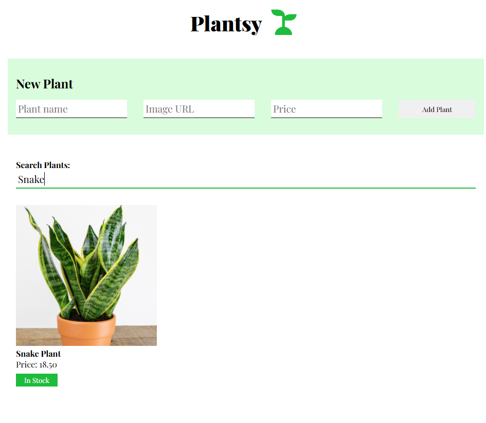

# Plantsy

Plantsy is a React application that allows users to manage a plant inventory. Users can browse available plants, search for plants by name, add new plants to the inventory, and mark plants as sold out.

## Features

- Display all plants retrieved from a backend API
- Search plants by name using a case-insensitive search
- Add new plants through a controlled form
- Persist newly created plants to the backend
- Mark plants as sold out using a stock status toggle
- Display loading and empty-state messages

## Screenshots



## Installation

Install project dependencies:

```bash
npm install
```

## Running the Application

Start the backend server:

```bash
npm run server
```

In a separate terminal, start the frontend application:

```bash
npm run dev
```

## Usage

When the application loads, all plants are fetched from the backend and displayed on the page.

Users can:

- Search for plants by entering text in the search field
- Add a new plant using the form
- Toggle a plant's stock status between **In Stock** and **Out of Stock**
- View a message when no plants match the current search criteria

## API Endpoints

### GET `/plants`

Returns all plants currently stored in the database.

Example response:

```json
[
  {
    "id": "1",
    "name": "Aloe",
    "image": "./images/aloe.jpg",
    "price": 15.99
  }
]
```

### POST `/plants`

Creates a new plant and persists it to the backend.

Example request:

```json
{
  "name": "Snake Plant",
  "image": "./images/snake-plant.jpg",
  "price": 24.99
}
```

## Technical Overview

### Data Fetching

Plant data is fetched from the backend when the application loads using React's `useEffect` hook and stored in component state.

### Search Functionality

Search is implemented using controlled React state and client-side filtering of plant names.

### Plant Creation

New plants are submitted to the backend using a `POST` request. After a successful response, the new plant is added to application state and displayed immediately.

### Stock Status

Stock status is managed locally within each `PlantCard` component using React state.

## Testing

The application passes all provided test suites:

- Display all plants on startup
- Add a new plant
- Mark a plant as sold out
- Search plants by name

## Technologies Used

- React
- JavaScript (ES6+)
- Fetch API
- JSON Server
- React Testing Library
- Jest

## Author

Created by Matthew Swanberg as part of a React Hooks + Simple Data Fetching lab assignment (Course 5, Module 2 Lab 2).